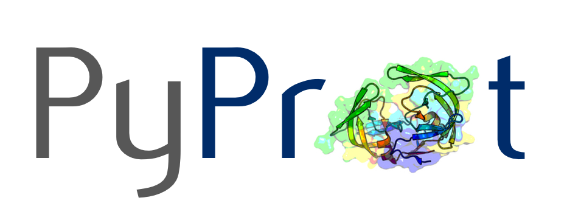

**pyprot is a Python package for working with protein structure files formats. It comes with a collection of ready-to-use scripts for the most common file operations and protein analyses.**

[[download pyprot.zip](https://github.com/rasbt/pyprot/archive/master.zip)] [[link to pyprot on GitHub](http://htmlpreview.github.io/?https://github.com/rasbt/pyprot/blob/master/README.html)]

## ReadMe Contents
- [Scripts and command line tools](#scripts-and-command-line-tools)
- [Tutorials](#tutorials)
- [Installation](#installation)

 
 

## Scripts and command line tools

pyprot provides ready-to-use command line scripts that are using the underlying `pyprot` objects to work with PDB and Mol2 files.  
The scripts are located in the subdirectory `./scripts` and can be used after `pyprot` was successfully installed.   

### List of command line tools

- Working with PDB files
    - [Center of Mass](./docs/tools/pdb_center_of_mass.md)
    - [Grab atoms within a radius](./docs/tools/pdb_grab_atom_radius.md)
    - [Root-mean-square deviation (RMSD)](./docs/tools/pdb_rmsd.md)
    - [PDB to FASTA conversion](./docs/tools/pdb_to_fasta.md)
    - [PDB atom and residue renumbering](./docs/tools/pdb_renumber.md)
    - [B-factor statistics](./docs/tools/pdb_bfactor_stats.md)
  
- Working with MOL2 files
    - [Transfer charges](./docs/tools/mol2_transfer_charge.md)
    - [Split multimol2 files](./docs/tools/mol2_split.md)

 
 

## Tutorials

 
 

## Installation

The pyprot package can be installed like any other "normal" Python package via 
	
	pip install pyprot
	
or 

	python setup.py install
	
after downloading it from this repository. Once the pyprot package is installed, the scripts and tools from the `./scripts` subdirectory are ready to use.   
For more details, please see the separate **["Installation Documentation"](./docs/pyprot_installation.md)**