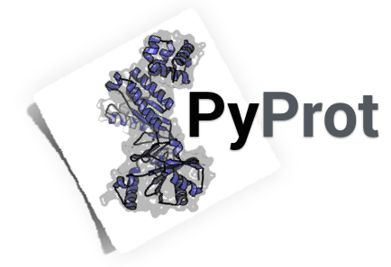

**PyProt is a Python package for working with protein structure files formats. It comes with a collection of ready-to-use scripts for the most common file operations and protein analyses.**

[[download pyprot.zip](https://github.com/rasbt/pyprot/archive/master.zip)] [[link to pyprot on GitHub](http://htmlpreview.github.io/?https://github.com/rasbt/pyprot/blob/master/README.html)]

 
 

## Scripts and command line tools

Please see the **["PyProt Tools Documentation"](./docs/pyprot_tools_doc.md)** for an overview of the currently provided scripts that are using the underlying `pyprot` classes to work with PDB and Mol2 files.  
The scripts are located in the subdirectory `./scripts` and can be used after `pyprot` was successfully installed.   

 
 

## Installation

The PyProt package can be installed like any other "normal" Python package via 
	
	pip install pyprot
	
or 

	python setup.py install
	
after downloading it from this repository. Once the PyProt package is installed, the scripts and tools from the `./scripts` subdirectory are ready to use.   
For more details, please see the separate **["Installation Documentation"](./docs/pyprot_installation.md)**