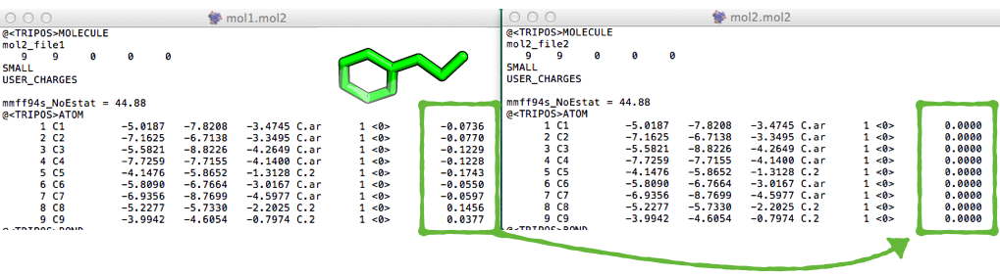

# PyProt Scripts and Tools

## Table of Contents
- [Working with PDB files](#working-with-pdb-files)
    - [Center of Mass](#center-of-mass)
    - [Grab atoms within a radius](#grab-atoms-within-a-radius)
    - [Root-mean-square deviation (RMSD)](#root-mean-square-deviation-rmsd)
    - [PDB to FASTA conversion](#pdb-to-fasta-conversion)
    - [PDB atom and residue renumbering](#pdb-atom-and-residue-renumbering)
- [Working with MOL2 files](#working-with-mol2-files)
    - [Transfer charges](#transfer-charges)
    - [Split multimol2 files](#split-multimol2-files)

 
 
 
 

# Working with PDB files
[[back to top](#table-of-contents)]

 
 

## Center of Mass

[[back to top](#table-of-contents)]

Calculates the center of mass for a protein and/or ligand structure in a PDB file weighted by atom types. By default, all atoms with valid ATOM and HETATM entries in the PDB file's coordinate section are included in the center of mass calculation.

**Example:**

	./pdb_center_of_mass.py -p ./tests/data/pdbs/3EIY.pdb 
	[8.979, 41.661, 12.495]

(**Tip**: you can can create a pseudo-atom at a given coordinate in PyMol via  
`pseudoatom masscenter, b=40, color=red, pos=[8.979, 41.661, 12.495]`)

**Usage**

<pre>
pdb_center_of_mass.py -h
usage: pdb_center_of_mass.py [-h] [-p] [-l] PDBfile

Calculates the weighted center of mass for structures in a PDB file.
By default, all atoms in the PDB file are included in the calculation.

positional arguments:
  PDBfile

optional arguments:
  -h, --help     show this help message and exit
  -p, --protein  Center of mass for atoms in ATOM sections only
  -l, --ligand   Center of mass for atoms in HETATM sections only

Example:
pdb_center_of_mass.py ~/Desktop/3EIY.pdb -p
[8.979, 41.661, 12.495]

Note that for the center of mass calculation, the relative
atomic weights are taken into account (atomic mass unit [u]).

A list of the atomic weights can be found, e.g., at
http://en.wikipedia.org/wiki/List_of_elements
</pre>

 
 
 
 

## Grab atoms within a radius

[[back to top](#table-of-contents)]

The pdb_grab_atom_radius.py script extracts atoms within a radius from a coordinate center.

**Example**  

<pre>./pdb_grab_atom_radius.py 3B7V.pdb -c 13.863,26.129,19.407 -r 7.0 -o 3B7V_rad7.pdb</pre>

**Usage** 

run `python pdb_grab_atom_radius.py --help` for the usage information:

	usage: pdb_grab_atom_radius.py [-h] [-r int/float] [-c X,Y,Z] [-i coordinate-ID]
	                           [-o out.fasta]
	                           PDBfile

	Extracts atoms within a radius from a PDB file.
	By default, all atoms in the PDB file are included in the calculation.

	positional arguments:
	  PDBfile

	optional arguments:
	  -h, --help            show this help message and exit
	  -r int/float, --radius int/float
	                        radius in Angstrom for atoms to extract (default 10.0)
	  -c X,Y,Z, --coordinates X,Y,Z
	                        center for extracting atoms (default "0,0,0")
	  -i coordinate-ID, --include coordinate-ID
	                        Coordinate lines to include (default: "ATOM,HETATM")
	  -o out.fasta, --out out.fasta
	                        writes atoms to an output file instead of printing it to the screen

 
 
 
 

## Root-mean-square deviation (RMSD)

[[back to top](#table-of-contents)]

The RMSD measures the average distance between atoms of 2 protein or ligand structures via the equation

where *ai* refers to the atoms of molecule 1, and *bi* to the atoms of molecule 2, respectively. The subscripts x, y, z are denoting the x-y-z coordinates for every atom.

The RMSD is most commonly calculated without taking hydrogen-atoms into consideration (typically only C-alpha or main-chain atoms in proteins).

**Example 1**  

RMSD between the alpha-carbon (main-chain) atoms of 2 closely aligned protein structures

	./pdb_rmsd.py ~/Desktop/1T48_995.pdb ~/Desktop/1T49_995.pdb -ca
	0.4785

**Example 2**  

RMSD between the carbon-atoms of 2 ligand conformations.
	
	./pdb_rmsd.py ~/Desktop/lig1.pdb ~/Desktop/lig22.pdb -l -c
	1.7249

**Usage**

	./scripts/pdb_rmsd.py -h

 

	usage: pdb_rmsd.py [-h] [-l] [-c] [-ca] PDBfile1 PDBfile2

	The RMSD measures the average distance between atoms 
	of 2 protein or ligand structures.
	By default, all atoms but hydrogen atoms of the protein are included in the RMSD calculation.
	NOTE: Both structures must contain the same number of atoms in similar order.

	positional arguments:
	  PDBfile1
	  PDBfile2

	optional arguments:
	  -h, --help     show this help message and exit
	  -l, --ligand   Calculates RMSD between ligand (HETATM) atoms.
	  -c, --carbon   Calculates the RMSD between carbon atoms only.
	  -ca, --calpha  Calculates the RMSD between alpha-carbon atoms only.

	Example:
	pdb_rmsd.py ~/Desktop/pdb1.pdb ~/Desktop/pdb2.pdb
	0.7377

 
 

## PDB to FASTA conversion
[[back to top](#table-of-contents)]

A script that converts amino acid residues from PDB files into a FASTA string.

**Usage:**

run `python pdb_to_fasta.py --help` for the usage information:

<pre>
usage: pdb_to_fasta.py [-h] [-l] [-o out.fasta] PDBfile

Converts amino acid residues from PDB file into a FASTA string

positional arguments:
  PDBfile

optional arguments:
  -h, --help            show this help message and exit
  -l, --ligand          includes HETATM residues.
  -o out.fasta, --out out.fasta
                        writes FASTA strings to an output file instead of printing it to the screen

</pre>

 
 

**Example**

command:

	python pdb_to_fasta.py 3B7V.pdb -o 3B7V.fasta

 
 

## PDB atom and residue renumbering
[[back to top](#table-of-contents)]

### Usage:

The `renumber_pdb.py` script renumbers atoms and/or residues in a PDB file.

run `./renumber_pdb.py --help` for the usage information:

<pre>
usage: renumber_pdb.py [-h] [-i INPUT] [-s START] [-a] [-r] [-c]

Renumber residues in a pdb file

optional arguments:
  -h, --help            show this help message and exit
  -i INPUT, --input INPUT
                        Input PDB file
  -s START, --start START
                        Number of the first residue in the renumbered file (default = 1)
  -a, --atoms           Renumbers atoms
  -r, --residues        Renumbers residues
  -c, --chainreset      Resets the residue renumbering after encountering a new chain.
  -v, --version         show program's version number and exit
</pre>

 
 

**Example**

**Command:**

	./renumber_pdb.py -i examples/example_1.pdb -a -r  > examples/out_1.pdb

**Input:**
<pre>
ATOM    774  N   LYS A 105      10.079  34.838  11.847  1.00 29.57           N  
ATOM    775  CA  LYS A 105      10.147  36.293  12.036  1.00 28.05           C  
ATOM    776  C   LYS A 105      11.562  36.720  12.391  1.00 27.06           C  
ATOM    777  O   LYS A 105      12.174  36.150  13.289  1.00 27.14           O  
ATOM    778  CB  LYS A 105       9.142  36.750  13.090  1.00 27.30           C  
ATOM    779  CG  LYS A 105       7.712  36.235  12.749  1.00 27.03           C  
ATOM    780  CD  LYS A 105       6.645  37.016  13.447  1.00 26.83           C  
ATOM    781  CE  LYS A 105       5.287  36.300  13.367  1.00 24.94           C  
ATOM    782  NZ  LYS A 105       4.698  36.387  11.996  1.00 23.03           N  
ATOM    783  N   LEU A 106      12.058  37.734  11.691  1.00 25.68           N  
ATOM    784  CA  LEU A 106      13.374  38.275  11.962  1.00 25.87           C  
ATOM    785  C   LEU A 106      13.354  39.143  13.222  1.00 25.22           C  
ATOM    786  O   LEU A 106      12.314  39.719  13.598  1.00 24.89           O  
ATOM    787  CB  LEU A 106      13.857  39.118  10.784  1.00 25.38           C  
ATOM    788  CG  LEU A 106      14.443  38.394   9.564  1.00 27.94           C  
ATOM    789  CD1 LEU A 106      13.727  37.094   9.184  1.00 27.95           C  
ATOM    790  CD2 LEU A 106      14.567  39.332   8.388  1.00 26.61           C  
[...]
</pre>

**Output:**
<pre>
ATOM      1  N   LYS A   1      10.079  34.838  11.847  1.00 29.57           N
ATOM      2  CA  LYS A   1      10.147  36.293  12.036  1.00 28.05           C
ATOM      3  C   LYS A   1      11.562  36.720  12.391  1.00 27.06           C
ATOM      4  O   LYS A   1      12.174  36.150  13.289  1.00 27.14           O
ATOM      5  CB  LYS A   1       9.142  36.750  13.090  1.00 27.30           C
ATOM      6  CG  LYS A   1       7.712  36.235  12.749  1.00 27.03           C
ATOM      7  CD  LYS A   1       6.645  37.016  13.447  1.00 26.83           C
ATOM      8  CE  LYS A   1       5.287  36.300  13.367  1.00 24.94           C
ATOM      9  NZ  LYS A   1       4.698  36.387  11.996  1.00 23.03           N
ATOM     10  N   LEU A   2      12.058  37.734  11.691  1.00 25.68           N
ATOM     11  CA  LEU A   2      13.374  38.275  11.962  1.00 25.87           C
ATOM     12  C   LEU A   2      13.354  39.143  13.222  1.00 25.22           C
ATOM     13  O   LEU A   2      12.314  39.719  13.598  1.00 24.89           O
ATOM     14  CB  LEU A   2      13.857  39.118  10.784  1.00 25.38           C
ATOM     15  CG  LEU A   2      14.443  38.394   9.564  1.00 27.94           C
ATOM     16  CD1 LEU A   2      13.727  37.094   9.184  1.00 27.95           C
ATOM     17  CD2 LEU A   2      14.567  39.332   8.388  1.00 26.61           C
</pre>
 
 

 
 
 
 

# Working with MOL2 files
[[back to top](#table-of-contents)]

 
 
 
 

## Transfer charges
[[back to top](#table-of-contents)]

Transfers partial charges from one mol2 file to another mol2 file.

**Example**

	./mol2_transfer_charge.py ~/Desktop/mol1.mol2 ~/Desktop/mol2.mol2
	@<TRIPOS>MOLECULE
	mol2_file2
	   9    9     0     0     0
	SMALL
	USER_CHARGES  
	mmff94s_NoEstat = 44.88
	@<TRIPOS>ATOM
	      1 C1         -5.0187   -7.8208   -3.4745 C.ar      1 <0>        -0.0736
	      2 C2         -7.1625   -6.7138   -3.3495 C.ar      1 <0>        -0.0770
	      3 C3         -5.5821   -8.8226   -4.2649 C.ar      1 <0>        -0.1229
	      4 C4         -7.7259   -7.7155   -4.1400 C.ar      1 <0>        -0.1228
	...

**Usage**

	./mol2_transfer_charge.py -h

 	
	
	usage: mol2_transfer_charge.py [-h] [-o OUT] [-r REFERENCE_COLUMN]
	                               [-t TARGET_COLUMN]
	                               MOL2File1 MOL2File2

	Takes a reference mol2 file as input and applies its charges
	to a second mol2 file

	positional arguments:
	  MOL2File1
	  MOL2File2

	optional arguments:
	  -h, --help            show this help message and exit
	  -o OUT, --out OUT     Writes output to a new mol2 file.
	  -r REFERENCE_COLUMN, --reference_column REFERENCE_COLUMN
	                        Position of the chargecolumn in reference molecule.
	                        -1 by default for the last column.
	                        E.g., -2 if charge is in the second last column.
	  -t TARGET_COLUMN, --target_column TARGET_COLUMN
	                        Position of the chargecolumn in the to-be-fixed molecule.
	                        -1 by default for the last column.
	                        E.g., -2 if charge is in the second last column.

 
 

## Split multimol2 files
[[back to top](#table-of-contents)]

The `mol2_split.py` splits a file that contains multiple MOL2 structures into individual MOL2 files where the names of the output files correspond to the name of the molecule in the input file.

**Usage:**

run `python ./split_multimol2.py --help` for the usage information:

<pre>
usage: mol2_split.py [-h] [-v] MOL2_FILE OUT_DIR

Splits a multi-MOL2 file into individual MOL2 files

positional arguments:
  MOL2_FILE
  OUT_DIR

optional arguments:
  -h, --help     show this help message and exit
  -v, --version  show program's version number and exit
</pre>

 
 

**Example**

Input: A file that contains multiple MOL2 structures.

	python ./mol2_split.py confs.mol2 my_out_dir

Output: MOL2 structures split into separate files.

