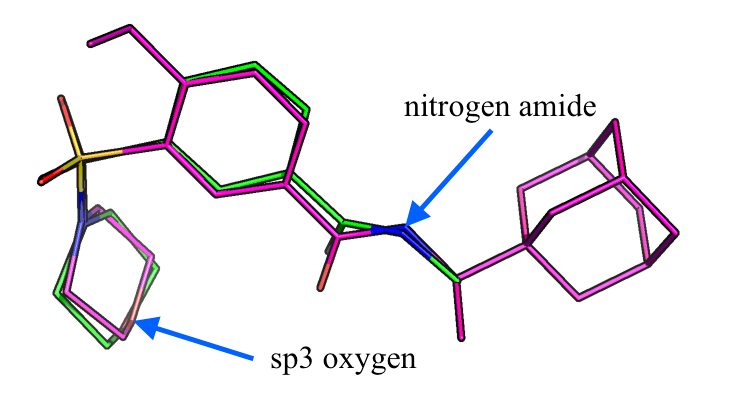

[[back to overview](../../README.md)]

# MOL2 intermolecular functional group screening

The `mol2_screening_intermol_funcgroup.py` compares functional group distances between a reference MOL2 structure and multiple query MOL2 structures.

For more info about the particular SYBYL atom types that are used in the MOL2 file format, please see [http://www.tripos.com/mol2/atom_types.html](http://www.tripos.com/mol2/atom_types.html).

**Please note that this tool expects that the query molecules were aligned to the reference molecule!** 

### Usage

Run `./mol2_screening_intermol_funcgroup.py --help` for usage information:

<pre>
usage: mol2_screening_intermol_funcgroup.py [-h] [-i1 INPUT1] [-i2 INPUT2]
                                            [-o OUTPUT] [-c CRITERIA]
                                            [-d DISTANCE] [-m]

Compare and filter for functional group 
distances between a reference MOL2 structure and multiple query MOL2 structures.

optional arguments:
  -h, --help            show this help message and exit
  -i1 INPUT1, --input1 INPUT1
                        MOL2 input file of the reference molecule.
  -i2 INPUT2, --input2 INPUT2
                        MOL2 input file of the query molecules.
  -o OUTPUT, --output OUTPUT
                        MOL2 output file for filtered results.
  -c CRITERIA, --criteria CRITERIA
                        Query atom and charge ranges, e.g., "O.2,-1.2,2;O.3,-20.0,100.0".
  -d DISTANCE, --distance DISTANCE
                        Min. and max. distance allowed between functional groups, e.g., "0,10".
  -m, --matchall        If flag is provided, molecules must satisfy all criteria.

Example:
./mol2_screening_intermol_funcgroup.py -i1 ~/Desktop/reference.mol2 -i2 ~/Desktop/query.mol2 -o ~/Desktop/filtered.mol2 -c "O.3,-2.0,1.0;N.am,-0.8,-0.2" -d "0,2"

</pre>

 
 

### Example

The atom type criteria provided via the `--criteria` flag as a semicolon-separated string where the each semicolon-separated entry consists of a atom type name and to values for the charge range. 

Distance criteria are provided via the `--distance` flag in form of comma-separated min and max values.

E.g., given the command `[...] --criteria "O.3,-2.0,1.0;N.am,-0.8,-0.2" --distance "0,2" --matchall` 

the following conditions are valued

1. A sp3-hybridized oxyen atom with a charge `> -2.0` and `< 1.0` must be present in both the reference and query molecule within a distance of `<= 2` Angstrom. 
2. A nitrogen amide with a charge `> -0.8` and `< -0.2` must be present in both the reference and query molecule within a distance of `<= 2` Angstrom. 

If the `--matchall` tag is provided, both condition (1) and (2) must be true. If the `--matchall` tag is **NOT** provided, either of those conditions is sufficient to write the query file to the output file.

 
 

**Input Reference File:** A file that contains 1 MOL2 structure.

**Input Query File:** A file that contains 5 MOL2 structures.

**Command:** 

	./mol2_screening_intermol_funcgroup.py -i1 \
	~/reference.mol2 -i2 \
	~/query.mol2 -o ~/filtered.mol2 \
	-c "O.3,-2.0,1.0;N.am,-0.8,-0.2" \
	-d "0,2" \
	--matchall

**Screen Output:** List of the evaluation for reference.

<pre>
REFERENCE--MOLECULE1 | 1x ['O.3', -2.0, 1.0] | 1x ['N.am', -0.8, -0.2] | 
REFERENCE--MOLECULE2 | 0x ['O.3', -2.0, 1.0] | 0x ['N.am', -0.8, -0.2] | 
REFERENCE--MOLECULE3 | 0x ['O.3', -2.0, 1.0] | 1x ['N.am', -0.8, -0.2] | 
REFERENCE--MOLECULE4 | 0x ['O.3', -2.0, 1.0] | 0x ['N.am', -0.8, -0.2] | 
REFERENCE--MOLECULE5 | 1x ['O.3', -2.0, 1.0] | 0x ['N.am', -0.8, -0.2] | 
</pre>

In this case, only the molecule `MOLECULE1` would be written to the output file.

**File Output:** A MOL2 file with the structures that match the criterion.

**PyMOL visualization:** 

