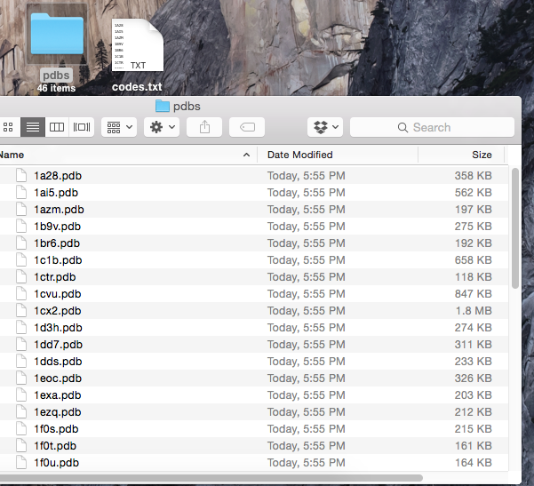

[[back to overview](../../README.md)]

# PDB downloader

A script that automatically downloads a batch of PDB files from the Protein Databank at [http://www.rcsb.org](http://www.rcsb.org).

### Usage

Run `./pdb_download.py --help --help` for usage information:

<pre>
usage: pdb_download.py [-h] [-i INPUT] [-o OUTPUT]

The RMSD measures the average distance between atoms 
of 2 protein or ligand structures.
By default, all atoms but hydrogen atoms of the protein are included in the RMSD calculation.
NOTE: Both structures must contain the same number of atoms in similar order.

optional arguments:
  -h, --help            show this help message and exit
  -i INPUT, --input INPUT
                        Path to a text file with PDB codes.
  -o OUTPUT, --output OUTPUT
                        Path of an output directory

The input file should contain 1 4-letter PDB code per line. E.g.,
3EIY
1HTG
1RX1
[...]
</pre>

 
 

### Example

**Input File:**

A simple text file where each line contains one PDB code.
<pre>1A28
1AI5
1AZM
1B9V
1BR6
1C1B
1CTR
1CVU
1CX2
1D3H
1DD7
1DDS
1EOC
1EXA
1EZQ
1F0S
[...]</pre>

**Command:**

	./pdb_download.py -i ~/Desktop/codes.txt -o ~/Desktop/pdbs

**Screen Output:**

	0%                          100%
	[###########                   ] | ETA[sec]: 21.753

**Screenshot of File Output:**

