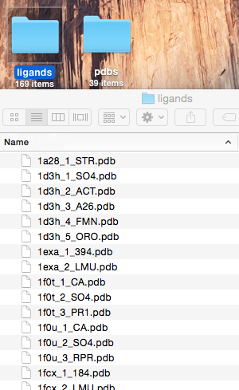

[[back to overview](../../README.md)]

# Extracting Ligands from PDB files

A script that automatically extracts ligands from a PDB file, enumerates the ligands, and saves them as separate ligand PDB files.

### Usage

Run `./pdb_extract_ligands.py --help` for usage information:

<pre>
usage: pdb_extract_ligands.py [-h] [-i INPUT] [-o OUTPUT]

Automatically autmatically extracts ligands from a PDB file and creates new PDB files for each ligand.

optional arguments:
  -h, --help            show this help message and exit
  -i INPUT, --input INPUT
                        Path to directory that contains PDB files.
  -o OUTPUT, --output OUTPUT
                        Path to target directory for ligand PDB files.
</pre>

 
 

### Example

**Input:**

A directory that contains 1 or multiple PDB files.

**Command:**

	./pdb_extract_ligands.py -i ~/Desktop/pdbs/ -o ~/Desktop/ligands/

**Screenshot of File Output:**

New directory that contains the ligand files enumerated and labeled by the parent PDB file as well as the ligand 3-letter code.

