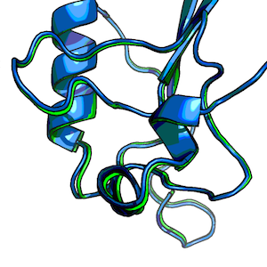

[[back to overview](../../README.md)]

# Root-mean-square deviation (RMSD)

The RMSD measures the average distance between atoms of 2 protein or ligand structures via the equation

where *ai* refers to the atoms of molecule 1, and *bi* to the atoms of molecule 2, respectively. The subscripts x, y, z are denoting the x-y-z coordinates for every atom.

The RMSD is most commonly calculated without taking hydrogen-atoms into consideration (typically only C-alpha or main-chain atoms in proteins).

### Usage

	./scripts/pdb_rmsd.py -h

 

	usage: pdb_rmsd.py [-h] [-l] [-c] [-ca] PDBfile1 PDBfile2

	The RMSD measures the average distance between atoms 
	of 2 protein or ligand structures.
	By default, all atoms but hydrogen atoms of the protein are included in the RMSD calculation.
	NOTE: Both structures must contain the same number of atoms in similar order.

	positional arguments:
	  PDBfile1
	  PDBfile2

	optional arguments:
	  -h, --help     show this help message and exit
	  -l, --ligand   Calculates RMSD between ligand (HETATM) atoms.
	  -c, --carbon   Calculates the RMSD between carbon atoms only.
	  -ca, --calpha  Calculates the RMSD between alpha-carbon atoms only.

	Example:
	pdb_rmsd.py ~/Desktop/pdb1.pdb ~/Desktop/pdb2.pdb
	0.7377

### Example 1 

RMSD between the alpha-carbon (main-chain) atoms of 2 closely aligned protein structures

	./pdb_rmsd.py ~/Desktop/1T48_995.pdb ~/Desktop/1T49_995.pdb -ca
	0.4785

### Example 2

RMSD between the carbon-atoms of 2 ligand conformations.
	
	./pdb_rmsd.py ~/Desktop/lig1.pdb ~/Desktop/lig22.pdb -l -c
	1.7249

