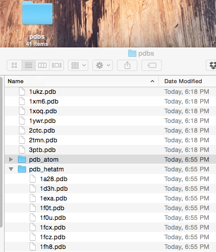

[[back to overview](../../README.md)]

# Separating ATOM and HETATM sections

A script that automatically creates separate PDB files with only ATOM (protein) and HETATM (usually ligand) section of input PDB files.

### Usage

Run `./pdb_split_atom_hetatm.py --help` for usage information:

<pre>
usage: pdb_split_atom_hetatm.py [-h] [-i INPUT]

Autmatically creates separate PDB files from ATOM and HETATM lines in a PDB file.

optional arguments:
  -h, --help            show this help message and exit
  -i INPUT, --input INPUT
                        Path to directory that contains PDB files.
</pre>

 
 

### Example

**Input:**

A directory that contains 1 or multiple PDB files.

**Command:**

	./pdb_download.py -i ~/Desktop/codes.txt -o ~/Desktop/pdbs

**Screenshot of File Output:**

Subdirectories that were created with the files that either contain only the ATOM section or the HETATM section.

